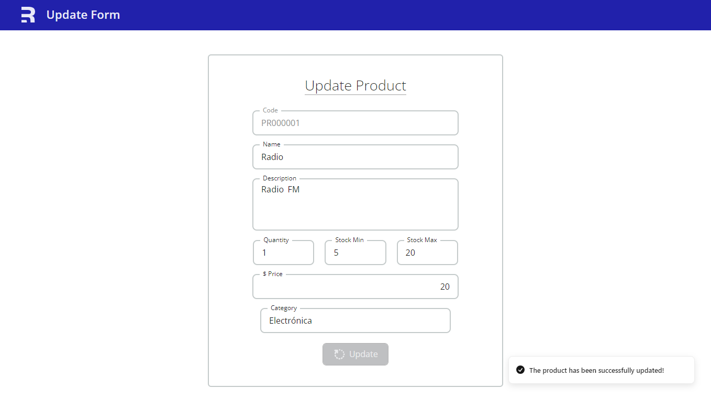
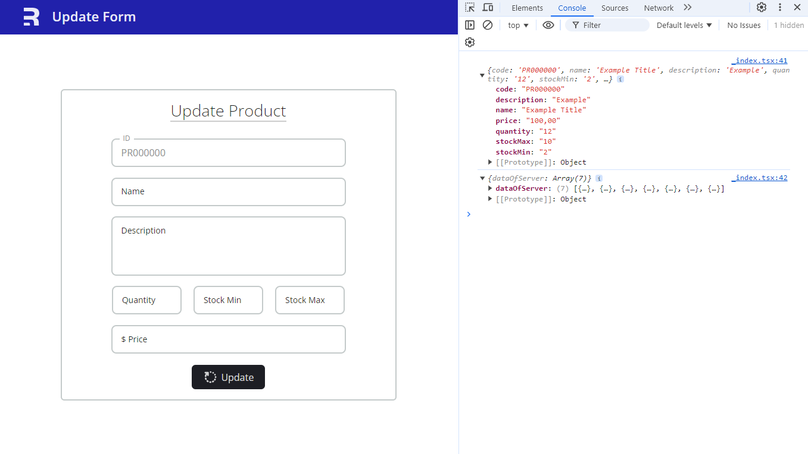

# Form Example with Remix.js

## Screenshots



<br>



## 📦 Installation

```shell
pnpm i
```

### 🧪 Run Dev

```shell
pnpm dev
```

## 🧐 Wait a moment

Don't forget to create the `.env` file with its respective variables.

## 🔑 License

[MIT Lisence](https://github.com/MeeLight/electiva_project/blob/main/remix_form_example/LICENSE.md)

